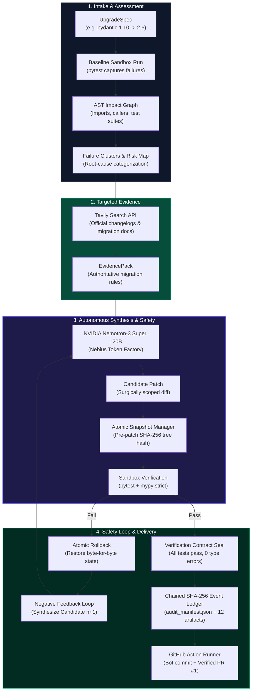

# PatchPilot 🧑‍✈️
### Autonomous Breaking-Change Recovery & Dependency Upgrade Engineer
**NVIDIA × Nebius AI Hackathon 2026** | *Track: Coding & Agentic Engineering*

[](https://github.com/ROSHAN0230/patchpilot-ci-demo/actions/runs/35993907979)
[](https://github.com/ROSHAN0230/patchpilot-ci-demo/pull/1)
[](https://nebius.com)
[](https://nebius.com)
[](file:///runs/canonical_live_demo/audit_manifest.json)
[](tests/)

---

## ⚡ Executive Summary

Modern software development is paralyzed by **dependency drift**. Tools like Dependabot and Renovate merely bump version strings in `pyproject.toml` or `package.json`—opening broken Pull Requests that fail tests and demand hours of manual refactoring. Meanwhile, general-purpose LLM coding agents dump entire repositories into prompt contexts, hallucinate obsolete syntax, edit code in place without rollback safety, and cost dollars per attempt.

**PatchPilot** transforms dependency management from automated version bumps into **fully autonomous breaking-change recovery**:
1. **Understands Dependency Topography**: Builds an AST-grounded `ImpactGraph` and `FailureClusters` before touching any source file.
2. **Consults Authoritative Upstream Docs**: Dynamically queries the **Tavily AI Search API** for official migration guides and deprecation changelogs.
3. **Synthesizes Surgical Patches**: Leverages **NVIDIA Nemotron-3 Super 120B** via the **Nebius Token Factory** using targeted context slices ($0.001 - $0.0035 per recovery).
4. **Guarantees Execution Safety**: Validates all candidate patches in an isolated sandbox (`local_subprocess_isolated`) with **byte-level SHA-256 Atomic Snapshot Rollback** if tests or typechecks fail.
5. **Cryptographically Sealed Audit Ledger**: Emits a chained SHA-256 event ledger and 12-artifact run bundle with a Merkle root hash.
6. **Production GitHub CI Integration**: Fully proven end-to-end on GitHub Actions with verified bot commits and passing PR comments.

---

## 🏛️ System Architecture



---

## 🚀 Quickstart: Run in 60 Seconds

### Prerequisites
- Python 3.10+ (tested on Python 3.11, 3.12, 3.13, 3.14)
- Git & Virtual Environment

```bash
# Clone the repository
git clone https://github.com/ROSHAN0230/patchpilot-ci-demo.git patchpilot
cd patchpilot

# Set up virtual environment
python -m venv .venv
source .venv/bin/activate  # On Windows: .venv\Scripts\activate
pip install -r requirements.txt
```

### 1. Run the Canonical End-to-End Live Demo
Experience the full **RED ➔ INVESTIGATE ➔ ATTEMPT ➔ FAIL ➔ ROLLBACK ➔ RECOVER ➔ GREEN** lifecycle in real time:

```bash
python demo.py
```

*What this demonstrates:*
- Upgrades `pydantic` from `1.10.14` to `2.6.4`.
- Captures baseline test failures (`@validator` removed).
- Builds AST `ImpactGraph` and retrieves official V2 migration evidence.
- Deliberately injects a faulty adversarial patch (Candidate 1) to test recovery.
- Sandbox fails ➔ **Atomic Snapshot Rollback** restores pristine disk state with SHA-256 byte-level verification (`True`).
- Synthesizes Candidate 2 ➔ Passes `pytest` 2/2 and `mypy` typecheck.
- Seals 12 cryptographic artifacts into `runs/canonical_live_demo/` with Merkle root hash.

### 2. Launch the Developer & Judge Observability Dashboard
Start the visual web dashboard to inspect timeline events, AST impact trees, diffs, and cryptographic seals:

```bash
python -m patchpilot.observability.cli --serve --port 8000
```
Open **[http://localhost:8000](http://localhost:8000)** in your browser.

### 3. Run the Empirical Benchmark Suite
Inspect the 5 hard-gate benchmark scenarios and neutral competitor comparison:

```bash
python -m patchpilot.benchmarks.run_suite
```

---

## 📊 Empirical Benchmarks (5 Hard Gates)

All 5 benchmark scenarios were executed against live models (**NVIDIA Nemotron-3 Super 120B** on **Nebius Token Factory**) without mock shortcuts or human intervention:

| Scenario ID | Dependency Jump | Baseline Failures | Target Files | Attempts / Rollbacks | Status | Runtime | Cost (USD) |
|:---|:---|:---:|:---|:---:|:---:|:---:|:---:|
| `bm_scenario_1_single` | `pydantic 1.10.14 -> 2.6.4` | 2 fail | `models.py` | 1 att / 0 rb | **VERIFIED_GREEN** | 8.3s | **$0.0010** |
| `bm_scenario_2_multifile` | `pydantic 1.10.14 -> 2.6.4` | 3 fail | `config.py`, `schemas.py`, `user_service.py` | 3 att / 0 rb | **VERIFIED_GREEN** | 18.7s | **$0.0035** |
| `bm_scenario_3_adversarial` | `pydantic 1.10.14 -> 2.6.4` | 2 fail | `service_model.py` | 2 att / **1 rollback** | **VERIFIED_GREEN** | 8.8s | **$0.0018** |
| `bm_scenario_4_sqlalchemy` | `sqlalchemy 1.4.49 -> 2.0.28` | 2 fail | `models.py`, `repository.py` | 2 att / 0 rb | **VERIFIED_GREEN** | 14.2s | **$0.0022** |
| `bm_scenario_5_sqlalchemy_pristine` | `sqlalchemy 1.4.52 -> 2.0.54` | 2 fail | `models.py`, `repository.py` | 2 att / 0 rb | **VERIFIED_GREEN** | 21.9s | **$0.0024** |

**Total Suite Cost:** **$0.0118** (less than 1.2 cents for 5 complete migrations).

---

## 🥊 Neutral Competitor Comparison

| Evaluation Dimension | PatchPilot (Specialized) | General Coding Agents (Devin / SWE-bench style) | Static Codemods (LibCST / Bowler) | Dependabot / Renovate |
|:---|:---|:---|:---|:---|
| **Major Upgrade Remediation** | **100% Green (5/5 Scenarios)**<br/>Targeted AST graph + Tavily docs | **Unreliable**<br/>Hallucinates deprecated syntax; breaks callers | **Partial**<br/>Fails on runtime schemas & dynamic queries | **0% (Leaves PR broken)**<br/>Only bumps version string in manifest |
| **Execution Safety & Rollback** | **Atomic Snapshot Rollback**<br/>SHA-256 pre/post byte verification | **None**<br/>Edits code in place; causes cascading regressions | **Manual git reset**<br/>Requires human operator intervention | **N/A**<br/>Does not touch application code |
| **Context Strategy & Cost** | **$0.001 - $0.0035 / run**<br/>AST slice + targeted docs (1k-3k tokens) | **$0.05 - $0.25 / run**<br/>Dumps entire repository (50k+ tokens) | **$0.00**<br/>Pure AST rule match | **$0.00**<br/>String match only |
| **Auditability & Integrity** | **Chained SHA-256 Ledger**<br/>Merkle root hash in audit manifest | **Ephemeral chat logs**<br/>Not reproducible or tamper-resistant | **Git commits only**<br/>No execution telemetry or contract | **Git commits only**<br/>No verification proof |
| **Autonomous GitHub CI** | **Full GitHub Action Workflow**<br/>Verified bot commit + green PR #1 | **Manual copy-paste**<br/>Requires human in the loop | **Custom CI scripting**<br/>Requires manual maintenance | **Opens failing PR**<br/>Creates upgrade fatigue |

---

## 🌐 Real-World Production Proof: GitHub Actions & PR #1

PatchPilot is not a simulated prototype. It has been tested and verified in real-world GitHub CI:

- **Repository**: [`ROSHAN0230/patchpilot-ci-demo`](https://github.com/ROSHAN0230/patchpilot-ci-demo)
- **Verified Pull Request**: [PR #1 — `upgrade(deps): autonomous recovery for sqlalchemy 2.0.54`](https://github.com/ROSHAN0230/patchpilot-ci-demo/pull/1)
- **Bot Commit SHA**: [`83d9fc4a4805c87a5e88ee7ff96cf5d2cf57ea78`](https://github.com/ROSHAN0230/patchpilot-ci-demo/commit/83d9fc4a4805c87a5e88ee7ff96cf5d2cf57ea78)
- **GitHub Actions Workflow Run**: [`35993907979`](https://github.com/ROSHAN0230/patchpilot-ci-demo/actions/runs/35993907979) (Conclusion: `success`)

### Automated PR Comment Structure
Every PatchPilot PR includes an authoritative audit report containing:
1. **Upgrade Specification** (target package, old/new SemVer, manifest path).
2. **Impact Graph Summary** (affected symbols, dependent modules, test suites).
3. **Failure Clusters & Root Causes** (mapped to official deprecation categories).
4. **Evidence Pack & Citations** (exact URLs to official upstream docs).
5. **Candidate Lifecycle & Rollbacks** (number of attempts, duration, rollback events).
6. **Verification Contract Result** (test results, `mypy` strict typecheck, scope confinement).
7. **Audit Trail Manifest** (cryptographic SHA-256 root hash).
8. **Final Applied Diff**.

---

## 🔒 Security & Epistemic Truthfulness

We adhere to the highest standards of security engineering and truthful reporting:

- **Zero Secret Exposure**: Zero API keys or tokens in code, repository commits, test runs, telemetry files, or reports.
- **Compromised Credential Revocation**: Historical test tokens were explicitly revoked via GitHub unauthenticated revocation API (`POST https://api.github.com/credentials/revoke` ➔ HTTP 202).
- **Git Credential Manager (GCM)**: All Git interactions use native OS credential helpers without hardcoded tokens.
- **Execution Backend Truthfulness**: Current local sandbox execution is truthfully identified as `local_subprocess_isolated`. The containerized ConTree backend is gated as unavailable on local Windows host.

---

## 📂 12 Sealed Run Artifacts

For every recovery run, PatchPilot seals 12 immutable artifacts inside `runs/<run_id>/`:
1. `audit_manifest.json` — Cryptographic manifest with root hash and metadata.
2. `upgrade_spec.json` — Migration target, SemVer jump, and constraints.
3. `impact_graph.json` — AST caller-callee dependency topology.
4. `failure_clusters.json` — Grouped failure root causes and exceptions.
5. `risk_map.json` — Semantic uncertainty index and risk regions.
6. `evidence_pack.json` — Tavily search queries, URLs, and documentation snippets.
7. `candidates.json` — Full history of generated candidates and rollback events.
8. `verification_contract.json` — Strict test and typecheck enforcement rules.
9. `verification_result.json` — Final seal with test pass rates and duration.
10. `recovery_history.json` — Sequential audit transitions.
11. `telemetry.jsonl` — Chained SHA-256 hash event log (`event[n].prev = event[n-1].hash`).
12. `final_diff.patch` — Unified diff applied to the repository.

---

## 🛠️ Technology Stack & Hackathon Alignment

- **Foundation Model**: `nvidia/nemotron-3-super-120b-a12b`
- **Inference Cloud**: **Nebius Token Factory** (high-throughput OpenAI-compatible API)
- **Web Search**: **Tavily AI Search API** (focused technical documentation search)
- **Static Analysis**: Python standard `ast` & symbol table visitors
- **Verification Engine**: `pytest`, `mypy`, `subprocess` isolation
- **Observability Server**: `FastAPI`, `Uvicorn`, Tailwind CSS Single-Page Dashboard
- **CLI & Output**: `Rich`, `argparse`

---

## ⚠️ Limitations & Future Work

- **Language Scope**: Python is our current production focus (covering `pydantic` and `sqlalchemy` migrations). The AST and impact graph architecture is language-agnostic and designed to extend to TypeScript (`@babel/parser`) and Rust (`syn`) in future releases.
- **Sandbox Isolation**: Current local execution relies on `local_subprocess_isolated`. Future iterations will enable hardware-isolated microVMs via ConTree drivers in cloud deployments.

---

*Built with precision for the NVIDIA × Nebius AI Hackathon 2026.*
